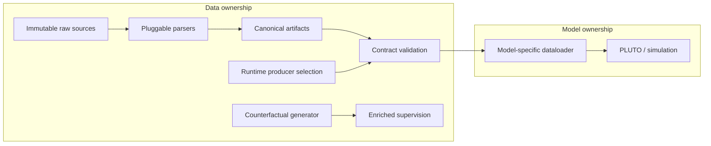

# hanelso-av — Contract-based ML Data Architecture & Model Pipeline

*Model-independent data contract, provenance, validation, and model-specific consumers for reproducible ML systems.*

hanelso-av는 이종 주행 로그와 HD map을 model-independent canonical representation으로 정리하고, data producer와 model consumer의 책임을 artifact contract로 분리하는 ML pipeline이다. Data side는 parser·schema·validation을 소유하고, model dataloader는 temporal sampling·좌표 변환·tensorization을 소유한다. 이 경계는 PLUTO dataloader의 명시적 `REQUIRES`와 contract preflight로 연결된다. ([parser contract](data_devkit/parsers/base.py#L7-L33), [canonical schema](data_devkit/parsers/schema.py#L7-L130), [PLUTO `REQUIRES`](planning/models/pluto/dataloader.py#L785-L825))

계약은 문서상의 추상화에 머물지 않는다. Apollo parser가 만든 canonical artifacts를 PLUTO-specific adapter가 소비하고, model-driven closed loop가 MP4와 metrics JSON을 산출한다. 별도 counterfactual engine은 자연 궤적에 통제된 개입을 적용하고 물리 quality gate 결과를 보존한다. ([Apollo record parser](data_devkit/parsers/apollo/record_parser.py#L230-L289), [closed-loop driver](simulation/drivers/model_driven.py#L38-L200), [metrics writer](simulation/render_sim.py#L135-L145), [counterfactual generator](data_devkit/counterfactual/generator.py#L89-L175))

## ML Data Architecture in one view

| Evidence | Repository-backed scope |
|---|---|
| **9** registered artifact contracts | `ARTIFACTS`에는 8개 non-empty spec과 producer가 없는 예약 `prediction` contract가 등록되어 있다. ([registry](data_devkit/contract.py#L65-L172)) |
| **7,608** generated counterfactual samples | OpenScene mini 64 logs·2,848 anchors 실행에 대해 저장소 README가 기록한 결과이며, 원시 `report.json`은 저장소에 포함되지 않는다. ([validation record](data_devkit/counterfactual/README.md#L26-L29), [report generation](data_devkit/counterfactual/generate_openscene.py#L101-L105)) |
| **88.5%** valid | 위 실행에서 생성 sample 중 curvature·lateral-acceleration 두 physical gate를 통과한 비율이며 model accuracy나 전체 dataset quality score가 아니다. ([gate logic](data_devkit/counterfactual/generator.py#L89-L119), [validation record](data_devkit/counterfactual/README.md#L26-L29)) |
| **1 command** to the PLUTO path | `scripts/sim.sh <record> --model pluto`가 선택된 model을 `run_sim.py`에 전달한다. ([launcher](scripts/sim.sh#L24-L50), [argument handoff](scripts/sim.sh#L101-L107)) |

## Architecture



Data ownership의 parser registry와 dataclass serialization은 source-specific parsing을 canonical tables에서 분리하고, model ownership의 `Dataloader.REQUIRES`와 PLUTO adapter는 변환 책임을 consumer에 둔다. Counterfactual generator는 현재 standalone output과 clip-scoped contract가 각각 존재하며 그 handoff는 아직 partial이다. ([parser registry](data_devkit/parsers/registry.py#L5-L40), [serialization](data_devkit/parsers/schema.py#L133-L159), [dataloader contract](planning/interface.py#L66-L109), [standalone output](data_devkit/counterfactual/generate_openscene.py#L101-L105), [registered path](data_devkit/contract.py#L151-L161))

## Why separate data knowledge from model knowledge?

Data producer가 각 model의 history window, 좌표계, object selection과 tensor layout까지 소유하면 model 변경이 raw-data pipeline 변경으로 전파된다. 이 구현은 reusable facts를 parser/schema/contract에 두고 PLUTO 고유 temporal sampling과 feature assembly를 dataloader에 둔다. ([canonical rows](data_devkit/parsers/schema.py#L7-L130), [history sampling](planning/models/pluto/dataloader.py#L418-L468), [feature assembly](planning/models/pluto/dataloader.py#L1003-L1103))

| Data side owns | Model side owns |
|---|---|
| Source parsing과 canonical schema ([parser ABC](data_devkit/parsers/base.py#L7-L33), [schema](data_devkit/parsers/schema.py#L7-L130)) | Required artifact 선택과 preflight ([`REQUIRES`](planning/models/pluto/dataloader.py#L785-L825)) |
| Artifact path·required key와 existence/schema validation ([`ArtifactSpec`](data_devkit/contract.py#L41-L53), [`check`](data_devkit/contract.py#L211-L303)) | Temporal sampling·model-native feature assembly ([sampling](planning/models/pluto/dataloader.py#L418-L468), [assembly](planning/models/pluto/dataloader.py#L1003-L1103)) |
| Config-level producer-selection axis ([`DATA_AXES`](data_devkit/contract.py#L29-L34), [validation](data_devkit/contract.py#L175-L191)) | Policy inference와 postprocess가 연결되는 simulation assembly ([assembly](simulation/render_sim.py#L85-L137)) |

## Evidence at a glance

| Capability | Implemented evidence |
|---|---|
| Heterogeneous ingestion | Apollo Record와 HD Map parser가 공통 parser contracts 뒤에 등록된다. ([record](data_devkit/parsers/apollo/record_parser.py#L230-L289), [map](data_devkit/parsers/apollo/map_parser.py#L84-L247), [registry](data_devkit/parsers/registry.py#L5-L40)) |
| Canonical representation | Dataclass rows와 JSON writers가 source output을 통합 table 형식으로 직렬화한다. ([rows](data_devkit/parsers/schema.py#L7-L130), [writers](data_devkit/parsers/schema.py#L133-L159)) |
| Artifact contract | `ArtifactSpec`, registry, required file/key 검사가 logical artifact를 consumption 전에 검사한다. ([spec/registry](data_devkit/contract.py#L41-L172), [key validation](data_devkit/contract.py#L194-L208), [check](data_devkit/contract.py#L211-L303)) |
| Producer selection | `agents="apollo_gt"`와 `prediction=None`만 현재 유효하며 추가 producer 이름은 예약 상태다. ([axes](data_devkit/contract.py#L29-L34), [agent contract](data_devkit/contract.py#L100-L123), [prediction reservation](data_devkit/contract.py#L162-L170)) |
| Fail-fast diagnostics | Missing/schema 오류에는 producer command hint, invalid provenance에는 supported values가 포함된다. ([provenance diagnostic](data_devkit/contract.py#L175-L191), [artifact diagnostic](data_devkit/contract.py#L270-L296), [unit tests](tests/test_contract.py#L12-L46)) |
| Actual ML consumer | PLUTO adapter가 contract를 검사하고 model-driven driver가 policy output으로 ego state를 전개한다. ([preflight](planning/models/pluto/dataloader.py#L803-L825), [driver](simulation/drivers/model_driven.py#L95-L167)) |
| Evaluation integrity | Closed-loop inference adapter는 injected simulated ego history를 사용하고 future ego tensor를 입력에 채우지 않는다. 이 범위는 vendored training builder 전체에 대한 주장이 아니다. ([closed-loop frame](planning/models/pluto/dataloader.py#L939-L975), [future handling](planning/models/pluto/dataloader.py#L1034-L1048), [reference-line packing](planning/models/pluto/dataloader.py#L1380-L1425)) |
| Temporal consistency | Decision, collision, renderer가 `log_idx`를 공유하고 post-step divergence는 다음 `time_idx`에 맞춘다. ([indices](simulation/drivers/model_driven.py#L95-L127), [metrics/rendering](simulation/drivers/model_driven.py#L168-L235)) |
| Dataset enrichment | `lane_transplant`와 `time_transplant`가 alternative goal과 target trajectory pair를 만든다. ([interventions](data_devkit/counterfactual/generator.py#L129-L163)) |
| Quality evidence | Curvature·lateral acceleration이 `valid`를 결정하고 vocabulary nearest distance는 threshold 없는 별도 metric이다. ([physical gates](data_devkit/counterfactual/generator.py#L44-L58), [valid decision](data_devkit/counterfactual/generator.py#L89-L119), [distance metric](data_devkit/counterfactual/generator.py#L61-L86)) |
| Reproducible assembly | Root config loader가 module configs를 병합하고 shell launcher가 선택 model과 환경을 전달한다. ([config assembly](common/config.py#L57-L127), [launcher handoff](scripts/sim.sh#L101-L107)) |

## Data Contract and producer selection

`ArtifactSpec`은 logical artifact의 `name`, `scope`, `required_files`, `provenances`, `axis`, `required_keys`, `produce_hint`를 선언한다. Dataloader class가 `REQUIRES`를 선언하면 `check()`가 파일·필수 키와 runtime producer selection을 모아 검사하고 위반 시 `ContractError`로 실패한다. ([`ArtifactSpec`](data_devkit/contract.py#L37-L53), [`check`](data_devkit/contract.py#L211-L303), [`Dataloader.REQUIRES`](planning/interface.py#L66-L109))

현재 provenance는 artifact 내부에 persisted lineage metadata를 기록하는 DAG가 아니라 root config에서 producer를 선택하고 검증하는 axis다. `bevfusion` producer와 non-null prediction producer는 등록되어 있지 않으며 `prediction` artifact는 contract-only reservation이다. ([valid axes](data_devkit/contract.py#L29-L34), [runtime report](data_devkit/contract.py#L233-L303), [reserved contract](data_devkit/contract.py#L162-L170))

## From contract to an actual PLUTO consumer

`Apollo Record + HD Map → parser → canonical artifacts → contract preflight → PLUTO dataloader → policy → model-driven closed loop → metrics/video` 경로가 코드로 연결되어 있다. ([record parser](data_devkit/parsers/apollo/record_parser.py#L230-L484), [map parser](data_devkit/parsers/apollo/map_parser.py#L84-L247), [preflight](planning/models/pluto/dataloader.py#L803-L825), [assembly](simulation/render_sim.py#L85-L145))

명시적 model 선택을 포함한 실행 진입점은 다음과 같다. Launcher는 Docker image 확인·mount·`run_sim.py` 호출을 담당한다. ([launcher flow](scripts/sim.sh#L69-L107))

```bash
scripts/sim.sh <record> --model pluto
```

Closed-loop 결과에는 MP4와 time/progress divergence, drivable-area, collision, emergency-brake summary가 포함된다. ([step metrics](simulation/drivers/model_driven.py#L168-L200), [summary/MP4](simulation/drivers/model_driven.py#L245-L268), [JSON writer](simulation/render_sim.py#L135-L145))

## Dataset Enrichment: Counterfactual Supervision

자연 궤적에 `lane_transplant` 또는 seeded donor selection 기반 `time_transplant`를 적용해 alternative goal과 corresponding trajectory를 만들며, token identity는 입력 기반으로 결정된다. 전체 payload에는 생성 시각이 들어가므로 byte-deterministic하다고 주장하지 않는다. ([token/interventions](data_devkit/counterfactual/generator.py#L34-L36), [interventions](data_devkit/counterfactual/generator.py#L129-L163), [payload timestamp](data_devkit/counterfactual/generator.py#L166-L175), [seeded CLI](data_devkit/counterfactual/generate_openscene.py#L49-L61))

Physical gate를 통과하지 못한 entry도 삭제하지 않고 `valid=false`와 원인 판별에 필요한 quality metrics를 보존한다. 자동 생성되는 rejection-reason 문자열은 없고 `flags`는 caller가 전달한다. Vocabulary nearest-distance는 분포를 측정하지만 pass/fail threshold는 없다. ([entry schema](data_devkit/counterfactual/generator.py#L89-L119), [preservation test](tests/test_counterfactual_schema.py#L59-L65), [coverage report](data_devkit/counterfactual/generator.py#L178-L193))

## Claim boundaries

| Status | Scope |
|---|---|
| ✅ **Implemented** | Parser contracts/registry, canonical dataclasses, 8 non-empty artifact specs, PLUTO contract preflight, model-driven closed loop, two counterfactual interventions와 physical gates. ([parsers](data_devkit/parsers/base.py#L7-L33), [artifacts](data_devkit/contract.py#L65-L161), [PLUTO](planning/models/pluto/dataloader.py#L785-L825), [counterfactual](data_devkit/counterfactual/generator.py#L89-L163)) |
| 🟠 **Partial** | Producer selection은 runtime config axis이며 persisted lineage가 아니다. Counterfactual standalone CLI와 clip-scoped contract의 handoff는 직접 연결되지 않았다. ([provenance](data_devkit/contract.py#L175-L191), [contract path](data_devkit/contract.py#L151-L161), [CLI path](data_devkit/counterfactual/generate_openscene.py#L101-L105)) |
| 🟡 **Contract / slot defined** | `prediction` artifact와 `bevfusion` 이름은 producer 구현 없이 예약되어 있다. ([prediction](data_devkit/contract.py#L162-L170), [agents axis](data_devkit/contract.py#L29-L34)) |
| ⬜ **Planned** | Raw camera/lidar/calibration E2E contract, SparseDriveV2 consumer, perception/localization implementations는 현재 설명 또는 placeholder 수준이다. ([data tiers](data_devkit/README.md#L26-L34), [SparseDriveV2 slot](planning/models/sparsedrive_v2/__init__.py#L1-L10), [perception placeholder](perception/interface.py#L1-L7), [localization placeholder](localization/interface.py#L1-L7)) |

상세한 engineering story는 [ML Data Architecture Case Study](docs/ml_data_architecture_case_study.md), claim별 구현 상태와 테스트는 [Evidence Map](docs/evidence_map.md), 짧은 소개는 [Portfolio Summary](docs/portfolio_summary.md)에 정리한다.

---

## Full Technical Documentation

### 기존 프로젝트 범위 — 계약으로 조립하는 자율주행 SW 스택

자율주행 SW 스택 — 센서 원본 → 데이터 → 인지 → 예측 → 판단(planning) → 시뮬레이션/평가 — 을 하나의 모노레포에서 개발한다. **이 프로젝트의 본체는 특정 모델이나 시뮬레이터가 아니라, 전 스택을 모듈로 나누고 경계마다 계약(ABC + registry + 데이터 계약)을 두어 갈아끼울 수 있게 조립하는 구조 그 자체다.** 모델·파서·렌더러는 그 구조에 꽂히는 교체 가능한 구성요소다.

**핵심 원칙 — 원본 기준(source-of-truth).** 모든 것은 불변의 원본 파일(주행 raw, HD맵, nuPlan/nuScenes, 이미지, 차량 제원)에서 출발한다. 원본은 절대 수정하지 않고, 파생물은 전부 원본에서 계산으로 뽑는다. *파싱 = 사실 기록, 정규화·가공 = 소비 시점 결정.*

---

## 계약 지도 (이 repo를 읽는 법)

스택의 각 경계는 계약으로 고정되고, 구현은 이름으로 선택된다. 어떤 슬롯은 이미 구현이 꽂혀 있고(활성), 어떤 슬롯은 계약만 먼저 존재한다(예약/빈 슬롯) — **계약이 구현보다 먼저**다.

| 경계 | 계약 | 현재 꽂힌 것 | 상태 |
|---|---|---|---|
| 원본 파싱 | `data_devkit/parsers` — `SourceParser` ABC + registry | `"apollo_record"` (record), `"apollo"` (HD맵) | 활성 |
| 측위(ego pose) | `EgoPoseProvider` ABC + registry | `"apollo_record"`, `"identity"` | 활성 (SLAM/odometry 슬롯 예약) |
| 데이터 아티팩트 | `data_devkit/contract.py` — 이름→경로·필수키 + provenance 축 | `sample`·`ego_pose`·`ego_dynamics`·`agent_tracks`·`scene_log`·`route`·`map_graph`·`counterfactual` | 8개 non-empty spec (`prediction` contract 예약) |
| 인지 | `agent_tracks` provenance 축 (`agents=`) | `"apollo_gt"` (로그 GT) | 활성 (`"bevfusion"` 예약) |
| 판단(planning) | `planning/interface.py` — policy/dataloader/postprocessor registry + `load_model(이름)` | `"pluto"` | 활성 (모델 추가 = 디렉토리 1개 + config 1개, 기존 파일 수정 0) |
| 지도 | `planning/map_adapter` — nuPlan `AbstractMap` duck-type | `ApolloMap` (`map_graph.json`) | 활성 |
| 차량 제원 | `calibration/` — 실차 물리 계약 | `e100`, `u100` | 활성 |
| 시뮬 주행 | `simulation/drivers` — `EgoDriver` ABC + registry | `"log_replay"`(open), `"model_driven"`(closed) | 활성 |
| 렌더 | `simulation/renderers` — `Renderer` ABC + registry | `"matplotlib"`, `"nuplan"` | 활성 |
| 실행 환경 | 모듈 config `env` 필드 = docker 이미지 (이미지는 모델/기능이 소유) | `av-base`(CPU 공용), `pluto-inf`(GPU 추론) | 활성 |
| localization / perception 도메인 | `interface.py` 자리 (planning 패턴 예비) | — | 빈 슬롯 |

**조립은 ROOT config가 한다.** `configs/*.py`는 "무엇을 쓸지" 이름만 적는 조립 명세서이고, `common/config.py::load_config`가 이름을 `<domain>/configs/<이름>.py`로 해석·병합한다:

```python
# configs/e100bt25.py — 이름만 고르면 전 스택이 조립된다
config = dict(
    record="data/bag/E100BT-25/20260716151711.record.00006",
    source="apollo_record", pose="apollo_record",        # 파싱·측위 선택
    map_name="AYG", map_path="work/maps/AYG/map_graph.json",
    data=dict(agents="apollo_gt", prediction=None),      # 아티팩트 출처(provenance) 선택
    modules=dict(planning="pluto", perception=None, localization=None),  # 도메인 슬롯
    calibration="e100",                                  # 실차 제원 선택
    simulation="closed_loop_nuplan",                     # sim 모드/렌더러 선택
)
```

의존 규칙: 드라이버는 concrete를 import하지 않는다(registry 문자열로만 획득). `simulation`은 `planning.interface`·`planning.nuplan_common`만 의존하고, 도메인 코드는 `planning/models/<이름>/src` 내부를 직접 import하지 않는다.

---

## 도메인 지도

| 도메인 | 한 줄 목표 | 현재 슬롯 상태 |
|---|---|---|
| **localization** | ego pose·시간 기준 확립 (좌표계의 토대) | Apollo MSF pose 소비(파서 provider). 자체 모델 슬롯은 빈 슬롯 |
| **perception** | 센서로부터 세계 상태(3D 객체·track) 추정 | 로그 GT(`apollo_gt`) 소비. `bevfusion` provenance 예약 |
| **data labeling** | perception 학습용 true-value 라벨 오프라인 생성 | 설계 단계 |
| **planning** | 궤적 생성 | **PLUTO 활성** (registry 온보딩 완료) |
| **simulation** | planning을 실주행 로그로 재현·검증 | **Apollo bag → PLUTO NR closed-loop 활성** |
| **tools** | 시각화·큐레이션·검수 등 횡단 지원 | parser_validation(BEV viz) 활성 |
| **common / data_devkit** | 도메인 관통 공유물 — config 조합, 파싱·계약·스키마 | 활성 |

```
원본(raw) ─▶ [data_devkit 파싱] ─▶ 통합 포맷(clip 단위, work/<clip>/parsed)
                                 ├─▶ localization ─┐
                                 ├─▶ perception ───┤
                                 ├─▶ data labeling ┤ (라벨)
                                 └─────────────────┴─▶ planning ─▶ simulation
                            tools = 전 단계 횡단 지원
```

---

## 리포지토리 구조

```
hanelso-av/
├── run_sim.py          # bag → sim mp4 원샷 오케스트레이터 (진입점)
├── parse_clip.py       # record → 통합 clip 아티팩트 파싱
├── parse_map.py        # base_map.bin → map_graph
├── pyproject.toml      # 공용 base 패키지 정의
├── common/             # config 조합 로더 등 도메인 관통 공유
├── data_devkit/        # 파싱 프레임워크 + 아티팩트 계약 — data_devkit/README.md
├── calibration/        # 차량 제원 config (E100 / U100 …)
├── planning/           # 판단 도메인 (PLUTO 활성) — planning/README.md
├── simulation/         # closed-loop 재현·렌더 — simulation/README.md
├── localization/       # 도메인 슬롯 (빈)
├── perception/         # 도메인 슬롯 (빈)
├── tools/              # 시각화·검수 (parser_validation 등)
├── tests/              # 골든 패리티 테스트 (feature 규격 ↔ 번들 native config)
├── configs/            # ROOT config = 조립 명세서 — configs/README.md
├── third_party/        # vendored 외부 소스 자리 (현재 비어 있음)
└── docker/             # 실행 환경 이미지 (av-base, pluto-inf) — docker/README.md
```

> `data/`(읽기전용 입력 — 물리 디스크 심볼릭)와 `work/`(파생물·캐시), `.venv-*`, 운영용 로컬 문서는 `.gitignore`로 git에서 제외된다. 리포에는 **코드 + 각 모듈 README**만 담긴다.

---

## 첫 관통 사례: Apollo bag → PLUTO closed-loop 시뮬레이션

위 조립 구조가 실물로 동작함을 증명한 첫 end-to-end 스레드. Apollo 7.0 주행로그(`.record`)와 HD맵을 입력으로, nuPlan 학습된 vectorized planner **PLUTO**를 태워 **non-reactive(NR) closed-loop** 주행 영상을 재현한다. PLUTO는 raw 센서가 아니라 벡터화된 상태(agent 궤적·ego·맵 polygon·reference line)를 먹으므로, 이 스레드의 실무는 **Apollo 산출물을 nuPlan 인터페이스 규격에 정합**시키는 어댑터다.

### `run_sim.py` 단계
```
record(.record) ─┬─▶ ① inspect_record   토픽/맵/차량 판정 (tools.parser_validation)
                 ├─▶ ② parse_clip.py    record → parsed 아티팩트
                 │        (sample · ego_pose · ego_dynamics · agent_tracks ·
                 │         scene_log · route · map_graph)
                 └─▶ ③ render_sim.py     closed_loop_nuplan 시뮬 → mp4 + metrics
```
- docker 이미지(av-base/pluto-inf) 하나에 파싱·추론·렌더 의존성이 모두 있어, 세 스테이지가 컨테이너 **단일 환경**에서 돈다 (host 파이썬 env 불필요 — 실행은 항상 `docker run`).

### 빠른 시작 — `scripts/sim.sh` (docker 한 줄, 권장)

**docker만 있으면 된다.** 파이썬 env 설치·`docker run` 타이핑이 필요 없다 — 런처가 이미지 확인(없으면 자동 빌드)·마운트·실행을 다 처리한다.

```bash
# CPU (기본)
scripts/sim.sh <record> --model pluto

# GPU
scripts/sim.sh <record> --model pluto --gpu --steps 100

# 옵션: --gpu  --steps N  --mode closed_loop|open_loop  --verbose  -h
```
- **전제**: `docker` 설치 + bag이 있는 데이터 디스크(`/mnt/hdd_storage`) 마운트. 이미지는 없으면 런처가 **자동 빌드**(처음 한 번만, 수 분~십수 분).
- **산출물**: `work/<clip>/sim/<mode>[_nuplan].mp4` (+ metrics json). 렌더러가 `nuplan`(closed_loop 기본값)이면 `_nuplan` suffix가 붙는다 — 예: `closed_loop_nuplan.mp4`.
- `--steps`는 넉넉히 준다. record별 perception rate가 달라(frame dt ≠ 0.1) 부족하면 뒤가 잘린다.

> 런처 없이 직접(`docker run …` 또는 host env)은 [docker/README.md](docker/README.md) 참고.

### 모델 직접 추론 (planning 도메인)
실행은 항상 `docker run` — 실추론(GPU)은 모델 소유 이미지 `pluto-inf`, 오프라인 sim(CPU)은 공용 이미지 `av-base`.

```bash
docker run --rm --gpus all -v "$PWD":/workspace -w /workspace pluto-inf:latest \
  python planning/run_inference.py configs/<scenario>.py --device cuda
docker run --rm -v "$PWD":/workspace -w /workspace av-base:latest \
  python simulation/render_sim.py configs/<scenario>.py
```
자세한 배치·registry·env 규약은 [planning/README.md](planning/README.md), 이미지 빌드는 [docker/README.md](docker/README.md) 참고.

---

## 환경

- **파이썬 base 패키지**: `pyproject.toml` (`hanelso-av`, requires-python ≥ 3.9, numpy / protobuf 3.20.3 / cyber_record).
- **단일 docker 환경이 기본 경로.** 이미지(av-base/pluto-inf) 하나에 파싱(cyber_record, Apollo `pb2`)·추론(torch, nuplan-devkit)·렌더 의존성이 모두 들어 있어 전 스테이지가 한 인터프리터로 돈다. 스테이지별로 다른 인터프리터가 필요한 특수한 경우만 `RUN_SIM_PY_*` env로 오버라이드한다(`run_sim.py` 상단 참고).
- **Docker**: `docker/base`(= `av-base`, CPU 시뮬 공용) / `docker/pluto-inf`(모델 GPU 추론). `docker/README.md` 참고.

---

## 데이터 규약

- **`data/` = 입력 한곳(읽기전용)**: 코드는 `data/raw/…`, `data/nuplan/…` 짧은 경로로 접근. 물리 디스크는 심볼릭으로 흡수 — 디스크가 옮겨져도 심볼릭만 교체하면 코드 무변경. ( data는 별도 필요 )
- **`work/` = 파생물 한곳, clip 단위**: `work/<clip>/`(parsed / sim / …). 스테이지별 캐싱으로 뒷단 수정 시 앞단 재실행을 막는다. `work/maps/`에 맵 그래프 캐시.
- **원본 직접수정 금지**, 실험은 복사본에서.

---

## 설계 원칙

1. **계약이 구현보다 먼저** — 경계는 ABC + registry + 데이터 계약으로 고정하고, 구현은 이름으로 선택한다. 새 구성요소는 계약에 와서 꽂힌다(기존 파일 수정 0). 새 포맷·필드는 구조·타입·의미를 먼저 문서화한 뒤 구현한다(명세 선행).
2. **재구현 금지** — 컨트롤러(LQR)·planner·렌더러는 레포의 진짜 nuPlan·PLUTO 컴포넌트를 duck-typing 어댑터로 재사용. 우리가 새로 짜는 건 경계의 어댑터(Apollo→nuPlan 규격 변환)뿐.
3. **상수 일치** — feature 상수(HIST_STEPS / RADIUS / MAX_AGENTS / ego shape)는 학습 분포와 정확히 맞춘다. 근거는 모델 번들의 native config(SoT)이며 전사하지 않는다.
4. **재현 우선(NR)** — 자연스러움보다 로그 재현. agent는 로그 시간축 그대로 재생하고, NR의 구조적 한계(유령트랙 등)는 입력 정제로 완화한다.
5. **버전 독립** — env 경계를 넘는 데이터는 python list로 직렬화.
