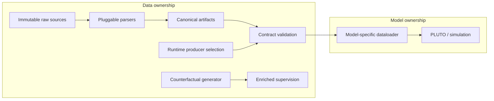

# data_devkit — Contract-based ML Data Architecture

*Model-independent data contract, provenance, validation, and model-specific consumers for reproducible ML systems.*

## 왜 이 경계인가(Data/Model Team coupling)

Data producer가 downstream model마다 다른 history/future window, sample frequency, coordinate convention, object selection, tensor layout과 native config까지 알아야 한다면 model 변경이 raw-data pipeline 변경으로 전파된다. 그래서 `Data Layer = reusable factual representation`, `Model Layer = consumer-specific interpretation`으로 분리했다. Source-specific 사실은 parser/schema/contract에 두고, PLUTO 고유 sampling과 feature assembly는 consumer에 둔다. ([parser contract](parsers/base.py#L7-L33), [PLUTO adapter](../planning/models/pluto/dataloader.py#L418-L468))

서로 다른 역할의 전문성 차이는 architecture boundary로 흡수한다. Data Engineer는 모든 model architecture를 알 필요가 없고, Model Engineer는 raw log parser와 source-specific detail을 반복 분석할 필요가 없다. 두 역할이 맞추는 지점은 artifact name, schema, semantic meaning, producer selection, validation rule이다.

| Data side owns | Model side owns |
|---|---|
| Source parsing, canonical schema, artifact path·required key, existence/schema validation | Required artifact 선택, temporal sampling, coordinate transformation, model-native feature assembly |
| Config-level producer-selection axis | Policy inference, postprocess, simulation assembly |

## Architecture



Data ownership의 parser registry와 dataclass serialization은 source-specific parsing을 canonical tables에서 분리하고, model ownership의 `Dataloader.REQUIRES`와 PLUTO adapter는 변환 책임을 consumer에 둔다. Counterfactual generator는 별도 Dataset Enrichment producer다. 현재 standalone output과 clip-scoped contract는 각각 존재하지만 그 handoff는 아직 partial이다. ([parser/serialization](parsers/schema.py#L133-L159), [counterfactual paths](contract.py#L151-L161))

## Key Evidence

| Capability | Implemented evidence |
|---|---|
| **Data Contract** | `ArtifactSpec` / `REQUIRES` / fail-fast validation으로 consumption 전에 파일·필수 키·runtime producer selection을 검사한다. **9 registered artifact contracts = 8 implemented non-empty contracts + 1 reserved `prediction` contract**다. ([contract registry](contract.py#L41-L172), [preflight](../planning/interface.py#L66-L109)) |
| **Actual Consumer** | Apollo log와 HD Map에서 canonical artifacts를 만들고 contract preflight를 거쳐 PLUTO policy와 non-reactive closed-loop simulation까지 연결한다. ([PLUTO preflight](../planning/models/pluto/dataloader.py#L803-L825), [closed-loop driver](../simulation/drivers/model_driven.py#L95-L200)) |
| **Dataset Enrichment** | Documented OpenScene mini validation record: 64 logs·2,848 anchors에서 **7,608** samples, physical-gate pass **88.5%**, vocabulary nearest distance p50 **0.30 m** · p90 **0.47 m**. `88.5%`는 curvature·lateral-acceleration gate 통과율이며 model accuracy, dataset quality score, training success rate가 아니다. 원시 `report.json`은 저장소에 포함되지 않는다. ([validation record](counterfactual/README.md#L26-L29), [gate logic](counterfactual/generator.py#L89-L119)) |
| **Reproducible Assembly** | Config-driven assembly, Docker environment, contract preflight와 **single launcher entry** to the PLUTO simulation path를 제공한다. `scripts/sim.sh <record> --model pluto` 실행에는 Docker, source data, map, model assets가 필요하다. ([config assembly](../common/config.py#L57-L127), [launcher](../scripts/sim.sh#L24-L107)) |

## 실제 consumer — PLUTO closed-loop

`Apollo Record + HD Map → parser → canonical artifacts → contract preflight → PLUTO dataloader → policy → model-driven closed loop → metrics/video` 경로가 코드로 연결되어 있다. Deployed closed-loop inference adapter는 injected simulated ego history를 사용하고 future ego ground truth를 입력에 채우지 않으며, simulation decision·collision check·rendering은 같은 log-time index를 공유한다. 이는 해당 adapter의 평가 무결성과 시간 정합 범위에 한정한 주장이다. ([closed-loop input](../planning/models/pluto/dataloader.py#L939-L1048), [time consistency](../simulation/drivers/model_driven.py#L95-L235))

## Dataset enrichment — counterfactual

`Natural trajectory → Controlled intervention → Alternative goal + target trajectory → Physical quality gate → Training supervision` 흐름이다. `lane_transplant`와 seeded donor selection 기반 `time_transplant`를 제공하고, invalid entry도 `valid=false`와 측정값을 보존한다. Vocabulary nearest-distance는 분포 측정값이며 pass/fail threshold는 없다. ([interventions](counterfactual/generator.py#L89-L175), [preservation test](../tests/test_counterfactual_schema.py#L59-L65))

## Claim boundaries

| Status | Scope |
|---|---|
| ✅ **Implemented** | Parser contracts/registry, canonical dataclasses, 8 non-empty artifact specs, PLUTO contract preflight, model-driven closed loop, two counterfactual interventions와 physical gates. ([contracts](contract.py#L65-L161), [counterfactual](counterfactual/generator.py#L89-L163)) |
| 🟠 **Partial** | Producer selection은 runtime config axis이며 persisted lineage가 아니다. Counterfactual standalone CLI와 clip-scoped contract의 handoff는 직접 연결되지 않았다. ([provenance/contract path](contract.py#L151-L191), [CLI path](counterfactual/generate_openscene.py#L101-L105)) |
| 🟡 **Contract / slot defined** | `prediction` artifact와 `bevfusion` 이름은 producer 구현 없이 예약되어 있다. ([prediction](contract.py#L162-L170), [agents axis](contract.py#L29-L34)) |
| ⬜ **Planned** | Raw camera/lidar/calibration E2E contract, SparseDriveV2 consumer, perception/localization implementations는 현재 설명 또는 placeholder 수준이다. ([data tiers](#데이터-티어-계약), [domain placeholders](../perception/interface.py#L1-L7)) |

## Deep dive

- [ML Data Architecture Case Study](docs/ml_data_architecture_case_study.md) — 상세 engineering story
- [Evidence Map](docs/evidence_map.md) — claim별 구현 상태와 test evidence

---

## 모듈 기술 문서

이종 원본(record/map)을 우리 통합 포맷(`work/`)으로 만드는 **파서**와, 그 산출물(아티팩트)의
**계약(존재+스키마) 검증**을 담는다. 구 `common/io`의 승격.

**핵심 원칙**: devkit은 모델을 모른다(모델별 분기 금지). 각 모델의 dataloader가
`REQUIRES`(아티팩트 이름 목록)를 선언하고 `contract.check()`로 fail-fast 검증한다.
`torch` import 금지 — 파싱 경로는 torch 없이 import 가능해야 한다.

## 구성

| 경로 | 역할 |
|---|---|
| `parsers/` | pluggable 파싱 프레임워크 (구 `common/io` 그대로). `base.py`(SourceParser/EgoPoseProvider/MapParser ABC), `registry.py`(문자열 키→클래스), `schema.py`(통합 포맷 dataclass+writer), `config.py`(ParseConfig), `apollo/`(record·map 파서, 키 `"apollo_record"`/`"apollo"`), `pose/`(`"apollo_record"`/`"identity"`). |
| `counterfactual/` | **반사실 goal 생성기** — 개입 2종 + 품질 게이트 + vocab 커버리지. 산출 `labels/counterfactual.json`. 스키마 규약은 generator와 tests에 요약되어 있고, 상세는 해당 README. |
| `contract.py` | **아티팩트 registry** — 이름 → `work/<clip>/`(clip-scope) 또는 `work/maps/<map>/`(map-scope) 경로규약 + 필수 파일/필수 키 + provenance 축. `check(clip_id, requires, data_cfg, map_name)` 실패 시 "무엇을 돌려야 하는지" 안내를 담은 `ContractError` (자동 생성 없음). |

## 아티팩트 (1차)

`sample`, `ego_pose`, `ego_dynamics`, `agent_tracks`(=sample_annotation+instance+category),
`route`, `scene_log`(=scene+log), `map_graph`(클립무관), `counterfactual`, `prediction`(예약, 생산자 없음).
provenance 축은 root config `data=dict(agents="apollo_gt", prediction=None)`이 고른다 —
현재 유효 값은 이 조합뿐(bevfusion/apollo는 예약). 스키마 체크는 "파일 존재+필수 키"
수준이며 물리 검증은 `tools/parser_validation` 소관.

## 데이터 티어 계약

- `raw`: 센서 원본 tier. record/bag, camera images, lidar, calib처럼 재파싱 가능한 원재료를 뜻한다.
- `parsed`: 현재 `work/<clip>/parsed`에 놓이는 통합 JSON 테이블 tier다.
- `derived`: 모델/평가용 파생 산출물 tier다. 예: `map_graph`, prediction, future sensor cache.

E2E·VLM 계열 모델은 `raw` tier를 직접 요구할 수 있다. 그 경우에도 같은 자리에 꽂히며,
camera/lidar/calib를 `REQUIRES`로 선언하는 방식으로 계약을 확장한다. `raw` tier의 실제 구현은
첫 소비자 모델이 들어올 때 추가한다.

센서 기반 E2E 모델의 closed-loop simulation은 센서 재시뮬레이션이 없으면 완전한 의미의 회귀가 아니다.

## 사용 예

```python
from data_devkit import contract
contract.check(
    clip_id="<clip_id>",
    requires=["sample", "ego_pose", "route", "map_graph"],
    data_cfg=dict(agents="apollo_gt", prediction=None),
    map_name="<map>",
)  # 누락 시 ContractError: "route 없음 -> parse_clip.py ... 실행 필요"
```

파싱 드라이버 — 실행은 항상 `docker run`:

```bash
docker run --rm -v "$PWD":/workspace -w /workspace av-base:latest \
  python parse_clip.py configs/<scenario>.py
docker run --rm -v "$PWD":/workspace -w /workspace av-base:latest \
  python parse_map.py --map <base_map.bin> --name <map>
```
